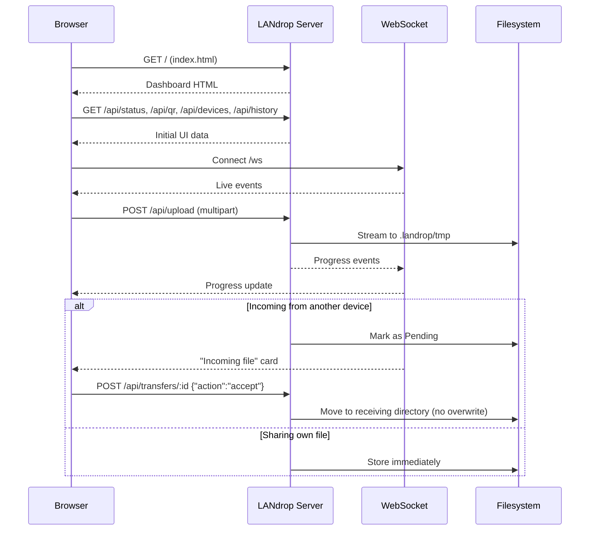

# 🦀 LANdrop

<div align="center">


**Local-first file sharing for devices on the same network.**

*No cloud. No account. No third party. Files move directly between your devices over your own Wi-Fi.*

[✨ Features](#-features) • [🏗️ Architecture](#-architecture) • [🚀 Quick Start](#-quick-start) • [📡 API](#-api-documentation) • [🔐 Security](#-security-considerations)

</div>

---

## 📖 Overview

**LANdrop** is a local-first file sharing application for devices on the same network. Nothing is uploaded to any cloud service — files travel **directly between your devices**, over your own Wi-Fi or LAN.

It's built in idiomatic async **Rust**, ships with a dependency-free vanilla JS dashboard, and is designed for the kind of transfers that should never touch the internet:

- Sending photos from your phone to your laptop
- Moving files between two computers on the same desk
- Sharing a document with someone in the same room
- Any transfer where "trust the cloud" isn't the right answer

### Core Idea

> **If two devices are already on the same network, there is no reason for a third party to be involved.**
>
> LANdrop makes that principle fast, safe, and pleasant to use.

---

## 📸 Screenshots

> _Screenshots of the dashboard, upload progress, and incoming-file prompt will be added here before publishing._

<div align="center">

| Dashboard | Upload Progress | Incoming File |
|:---:|:---:|:---:|
| _coming soon_ | _coming soon_ | _coming soon_ |

</div>

---

## ✨ Features

<div align="center">

| 📶 Local-First | 📱 QR-Code Connect |
|:---:|:---:|
| Files never leave your network — nothing uploads to any cloud | Scan a QR code to open the dashboard from your phone |
| **🖱️ Drag & Drop Uploads** | **📥 Accept / Reject Prompts** |
| Live progress, speed, and ETA | Nothing is saved without explicit approval — and existing files are never overwritten |
| **🔄 Real-Time Updates** | **🔍 LAN Discovery** |
| WebSocket events — no polling, no page refresh | UDP broadcast with manual IP / QR fallback |
| **🔐 Optional PIN Protection** | **🛡️ Hardened File Handling** |
| Session tokens, reset on restart, never written to disk | Filename sanitization + path traversal protection |
| **🌗 Dark / Light Mode** | **🦀 Idiomatic Rust** |
| Responsive, keyboard accessible | No `unwrap()` in production paths, real test suite |

</div>

### Detailed Feature List

- **Local-first by design** — files move directly between devices on your LAN; nothing is ever uploaded to a third party
- **QR-code connection** — scan to open the dashboard from any phone on the network
- **Drag & drop uploads** with live progress, speed, and ETA
- **Accept / reject prompts** for incoming files — nothing hits disk without your explicit approval, and existing files are never overwritten (collisions are auto-suffixed `(1)`, `(2)`, …)
- **Real-time updates** over WebSocket — no polling, no page refresh
- **LAN discovery** via UDP broadcast, with manual IP / QR connection as a fallback when broadcast traffic is blocked
- **Optional PIN protection**, filename sanitization, and path traversal protection
- **Dark / light mode**, responsive layout, keyboard accessible
- **Written in idiomatic async Rust** with **no `unwrap()` in production code paths** and a real test suite

---

## 🏗️ Architecture

### Project Layout

```
landrop/
├── Cargo.toml
├── src/
│   ├── main.rs          # CLI bootstrap: parses args, starts the server
│   ├── lib.rs            # library root (re-exports everything below)
│   ├── config.rs         # CLI args + resolved runtime configuration
│   ├── server.rs         # AppState + axum Router assembly
│   ├── routes/
│   │   ├── mod.rs
│   │   ├── auth.rs        # PIN verification + session tokens
│   │   ├── status.rs      # /api/status, /api/qr
│   │   ├── devices.rs     # /api/devices
│   │   ├── upload.rs      # streaming multipart upload
│   │   └── download.rs    # download, history, accept/reject, delete
│   ├── websocket.rs       # broadcast channel + /ws handler
│   ├── discovery.rs       # UDP broadcast LAN discovery
│   ├── security.rs        # filename sanitization, path traversal guards
│   ├── storage.rs         # in-memory + JSON-persisted transfer history
│   └── models.rs          # shared request/response/domain types
├── web/
│   ├── index.html
│   ├── style.css
│   └── app.js             # vanilla JS — no framework, no build step
└── tests/
    └── api_integration.rs
```

### Library + Binary Split

The binary is a **thin wrapper around a library crate** (`landrop`). This means integration tests build the **real** `axum::Router` in-process (via `tower::ServiceExt::oneshot`) instead of needing a live TCP socket — fast, deterministic, and actually exercises the code you ship.

### Request Flow



### Request Flow Summary

1. A browser loads `/`, which serves `web/index.html`. Static assets are served from `web/` under `/static/*`.
2. The dashboard calls `GET /api/status` and `GET /api/qr` to render the connection card, then `GET /api/devices` and `GET /api/history` to populate the rest, then opens a `GET /ws` WebSocket for live updates.
3. Dragging a file in POSTs `multipart/form-data` to `POST /api/upload`, **streamed directly to a temporary holding file** while progress events are broadcast over the WebSocket.
4. If the upload came from another device sending *to* you, it lands in `Pending` state and appears as an **"Incoming file"** card. Accepting it (`POST /api/transfers/:id` with `{"action":"accept"}`) moves it into the receiving directory — **never overwriting an existing file**. Rejecting it deletes the temp file. If you're sharing your *own* file from the dashboard, it's stored immediately and becomes downloadable by peers.

---

## 🚀 Quick Start

### Requirements

- **Rust 1.75+** (2021 edition)
- A local network that permits **UDP broadcast** *(optional — only needed for automatic discovery; manual IP/QR connection always works)*

### Installation

```bash
git clone https://github.com/yourname/landrop.git
cd landrop
cargo build --release
```

### Run

```bash
cargo run
```

This starts LANdrop on port `8080`, writing received files to `./received`. Open the printed address — or the same address from another device on your network — and scan the QR code shown in the dashboard.

```
╭──────────────────────────────────────────╮
│              🦀 LANdrop                   │
╰──────────────────────────────────────────╯

  Device       my-laptop
  Status       ● Running
  Address      http://192.168.1.25:8080
  Directory    ./received
  Discovery    Enabled
  PIN          Disabled
  Max file     4096 MB

  Scan the QR code in the dashboard to connect from another device.

  Waiting for devices...
```

---

## 🎛️ CLI Usage

```bash
landrop                          # start with defaults
landrop --port 9000              # custom port
landrop --directory ~/Downloads  # where received files are saved
landrop --pin 123456             # require a PIN to use the dashboard/API
landrop --no-discovery           # disable UDP broadcast discovery
landrop --max-file-size-mb 1024  # cap uploads at 1 GB
landrop --no-history             # don't persist transfer history to disk
landrop --log-level debug        # error | warn | info | debug | trace
landrop --bind 127.0.0.1         # restrict to localhost only
```

### Configuration

| Flag | Default | Description |
|------|---------|-------------|
| `--port` | `8080` | HTTP port to listen on |
| `--bind` | `0.0.0.0` | Interface to bind (all interfaces by default) |
| `--directory` | `./received` | Where accepted/shared files are stored |
| `--pin` | _(none)_ | 4–8 digit PIN required to use the dashboard |
| `--no-discovery` | off | Disable UDP broadcast discovery |
| `--max-file-size-mb` | `4096` | Maximum accepted upload size, in MB |
| `--no-history` | off | Disable persisting transfer history to disk |
| `--log-level` | `info` | `error` / `warn` / `info` / `debug` / `trace` |

---

## 🔐 Security Considerations

LANdrop is built for **trusted local networks** — it is *not* designed to be exposed to the public internet.

### What It Implements

| Protection | How |
|-----------|-----|
| **Filename sanitization** | Every filename is sanitized before touching the filesystem |
| **Path traversal protection** | Re-validated against the target directory via `security::safe_join` |
| **No silent overwrites** | Collisions auto-suffix `(1)`, `(2)`, etc. |
| **Optional PIN auth** | Random, in-memory session tokens — reset on restart, never written to disk |
| **Max file size** | Enforced as an HTTP body limit **and** during streaming, so oversized uploads abort early |
| **Safe temp files** | Incoming files stream to a private `.landrop/tmp` directory; only moved after explicit accept |
| **No arbitrary filesystem access** | Server only reads/writes inside the configured receiving directory and its own data directory |

### What It Does Not Do

> ⚠️ **LANdrop does not implement TLS.** Traffic is unencrypted HTTP.
>
> This is a reasonable trade-off for "phones on the same Wi-Fi," but **not for the open internet**. If you expose LANdrop beyond your LAN (via a VPN or port forward), set a PIN — and understand that TLS support is on the roadmap.

---

## 📡 API Documentation

| Method | Path | Auth\* | Description |
|--------|------|:------:|-------------|
| `GET` | `/` | — | Dashboard HTML |
| `GET` | `/api/status` | — | Server status (online, address, config) |
| `GET` | `/api/qr` | — | QR code (SVG) encoding the connection URL |
| `GET` | `/api/devices` | ✅ | List of known LAN devices |
| `POST` | `/api/upload` | ✅ | Multipart upload (`file`, optional `sender`, `direction`) |
| `GET` | `/api/download/:id` | ✅ | Stream a completed transfer's file |
| `POST` | `/api/transfers/:id` | ✅ | `{"action":"accept"\|"reject"}` for a pending incoming file |
| `DELETE` | `/api/transfers/:id` | ✅ | Remove a transfer from history |
| `GET` | `/api/history` | ✅ | Full transfer history |
| `POST` | `/api/auth` | — | Exchange a PIN for a session token |
| `WS` | `/ws` | — | Real-time transfer/device events |

\* Auth is only enforced when `--pin` is set. Send the token from `/api/auth` in the `X-Landrop-Token` header.

**Error format** — all errors return JSON:

```json
{
  "error": "snake_case_code",
  "message": "human readable"
}
```

---

## 🛠️ Development Guide

```bash
cargo fmt
cargo clippy --all-targets --all-features
cargo build
```

The project is split into a **library crate** (`src/lib.rs`) and a **thin binary** (`src/main.rs`) specifically so integration tests can exercise the real `axum::Router` **in-process** without opening a socket.

---

## 🧪 Testing

```bash
cargo test
```

### What's Covered

- **Filename sanitization & path traversal prevention** (`src/security.rs`)
- **PIN hashing/verification and token generation** (`src/security.rs`)
- **CLI/config validation**, including PIN format rules (`src/config.rs`)
- **Transfer state transitions and history persistence** (`src/storage.rs`)
- **End-to-end API behavior** — status, PIN auth flow, 404s, QR content type (`tests/api_integration.rs`)

---

## 🗺️ Roadmap

- [ ] **TLS support** — self-signed cert generated on first run, for encrypted LAN transfers
- [ ] **Direct device-to-device push** — send straight to a discovered peer without opening their dashboard first
- [ ] **Resumable uploads** — for very large files and flaky Wi-Fi
- [ ] **Folder transfers** — multi-file or archive uploads
- [ ] **mDNS / Bonjour discovery** — as an alternative to UDP broadcast

---

## 🤝 Contributing

Contributions are welcome. Please:

1. Fork the repository
2. Follow the existing library + binary split
3. **No `unwrap()` in production code paths** — return `Result` and handle it
4. Add or update tests for any new behavior
5. Run `cargo fmt` and `cargo clippy --all-targets --all-features` before submitting
6. Submit a Pull Request

### Guidelines

- **Keep the "no cloud" promise** — no telemetry, no external calls
- **Local-first, always** — everything must work on a LAN with no internet
- **Security is not optional** — sanitize, validate, and never trust filenames from the wire
- **The dashboard stays dependency-free** — vanilla JS, no build step

---

## 📜 License

MIT — see [LICENSE](LICENSE) for details.

---

## 🙏 Acknowledgments

- **Tokio** — for making async Rust feel natural
- **Axum** — for a router that's a pleasure to test
- **Every developer who's ever emailed themselves a file** — this one's for you

---

<div align="center">

### 🦀 YOUR NETWORK. YOUR FILES. YOUR RULES.

**If two devices are already on the same Wi-Fi, why involve anyone else?**

<br>

⭐ If LANdrop helped you, consider giving it a star.

<br>

[⬆ Back to Top](#-landrop)

</div>
